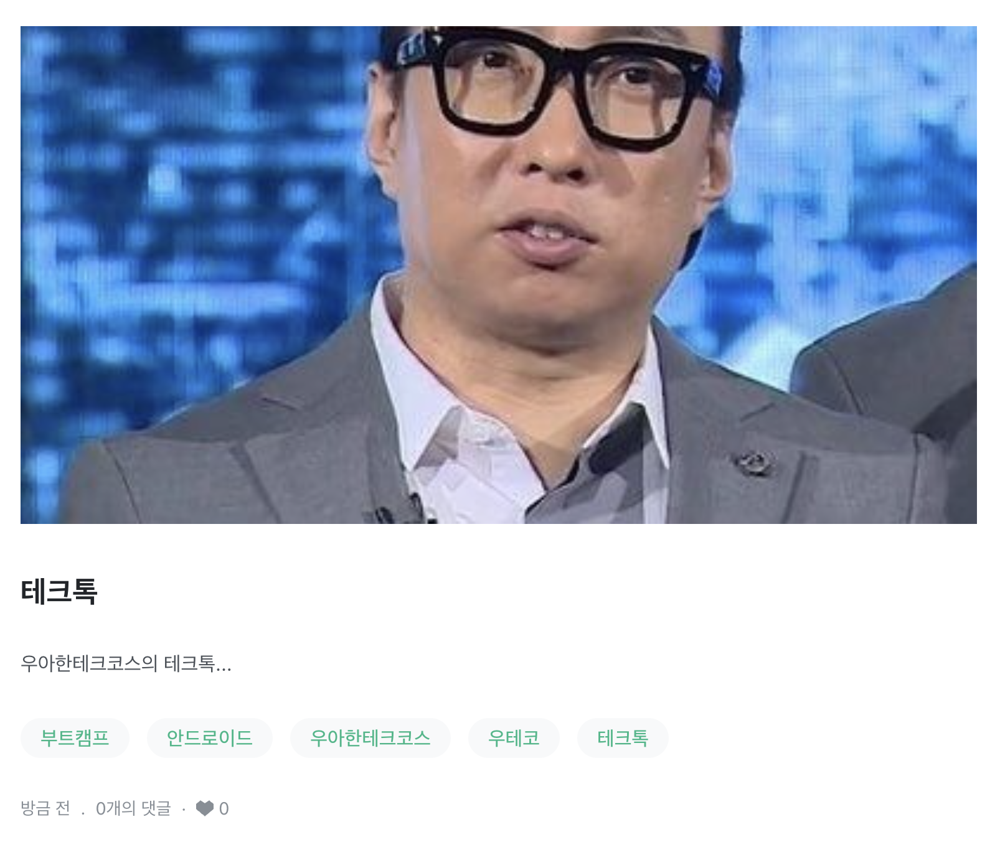
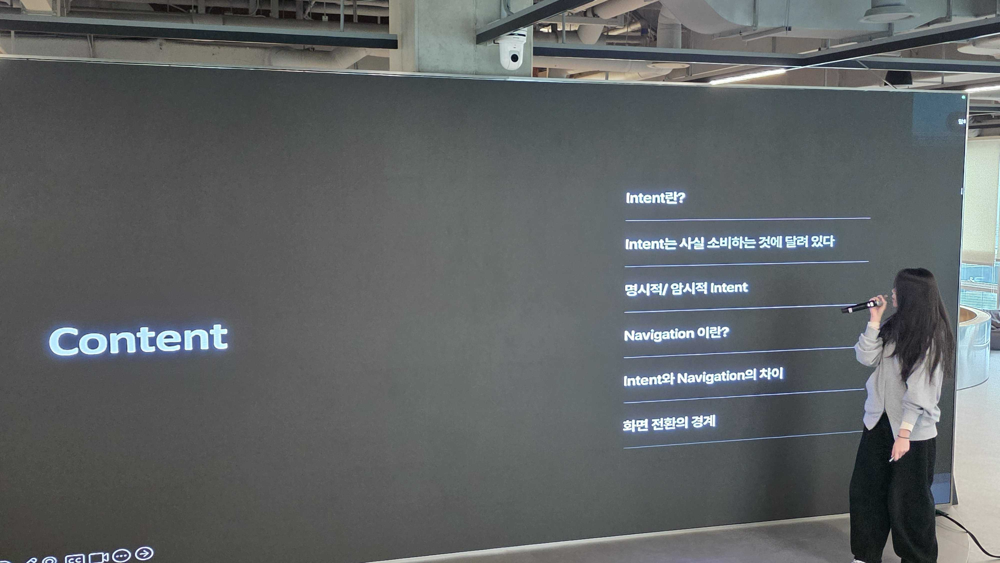

## 테크톡이란?

테크톡은 기술(Technology)과 이야기(Talk)의 합성어로, IT 및 개발 분야에서 기술적인 지식, 경험, 인사이트를 나누는 발표나 세미나를 의미합니다.

우아한테크코스에서는 매주 목요일마다 파트별로 총 5명씩 테크톡 발표를 진행합니다. 발표 순서는 랜덤으로 배정되지만, 원하는 사람들끼리는 순서를 변경할 수 있고, 주제에 따라 발표 순서가 임의로 조정되기도 합니다.

또한 발표한 내용은 이후 유튜브에 업로드됩니다.

[우아한테크코스 테크톡 유튜브](https://www.youtube.com/playlist?list=PLgXGHBqgT2TvpJ_p9L_yZKPifgdBOzdVH)

## 테크톡 발표

저는 5월 21일, Intent와 Navigation 화면 전환의 경계라는 주제로 발표를 진행했습니다.

[테크톡 발표 자료](https://www.notion.so/34ea6460af3c8056bb9bcfc464d559b2?source=copy_link)

## 소감

발표 주제를 정하던 시기에 진행하던 미션에서 화면 전환 방식을 Intent에서 Navigation으로 수정하는 작업이 있었습니다.

그 과정에서 이런 생각이 들었습니다.

Intent도 화면 전환을 할 수 있고, Navigation도 화면 전환을 할 수 있는데
둘 다 비슷한 역할을 하는 것처럼 보인다면, 실제로는 무엇이 다르고 언제 어떤 방식을 사용하는 것이 좋을까?

이 궁금증에서 출발해 발표 주제를 정하게 되었습니다.

처음에는 단순히 둘 다 화면 전환을 하고 Intent는 외부를 나갔다가 복귀할 수 있다는 차이점이 있다는 정도만 알고 있었습니다
근데 준비를 하면서 Intent는 안드로이드 컴포넌트 실행 요청에 가깝고, Navigation은 앱 내부 화면 목적지 전환을 관리하는 역할에 가깝다는 차이를 조금 더 깊게 이해할 수 있었습니다.

또한 발표를 준비하면서 다른 크루들이 어떤 질문을 할지 미리 예상해보고, 그 질문에 답할 수 있도록 다시 공부하는 과정도 많은 도움이 되었습니다.
남에게 설명하기 위해 공부하는 과정이 왜 나에게도 큰 도움이 되는지 직접 느낄 수 있었습니다.

실제로 이후 미션을 구현할 때도 이미 테크톡을 준비하며 정리해둔 내용이 있었기 때문에, Intent와 Navigation을 어떤 기준으로 구분해서 사용할지 판단하는 데 훨씬 수월했습니다.

다만 유튜브에 발표 영상이 올라간다는 사실 때문인지 생각보다 부담도 컸고, 발표 당일에는 많이 긴장했습니다. 10분 안에 준비한 내용을 모두 전달해야 했는데, 예상보다 시간이 짧게 느껴져 중간중간 내용을 스킵하며 발표하게 되었습니다.

그 때문에 발표 흐름이 조금 매끄럽지 못했던 것 같고, 준비한 만큼 충분히 보여주지 못했다는 아쉬움도 남았습니다.

그래도 이번 테크톡을 통해 하나의 기술을 단순히 사용하는 것에서 끝내지 않고, 왜 이 기술을 사용하는지, 비슷해 보이는 기술과 어떤 차이가 있는지를 고민해보는 경험을 할 수 있었습니다.
앞으로도 기술을 사용할 때 단순히 구현에만 집중하기보다, 그 기술이 맡는 역할과 책임을 함께 고민하는 습관을 가져가고 싶습니다.